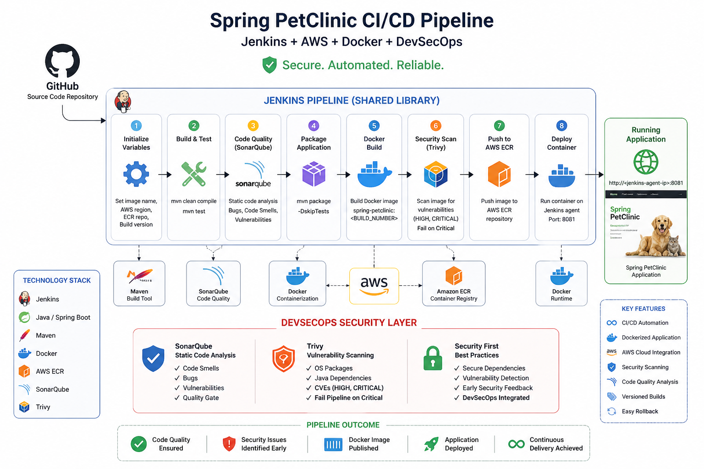
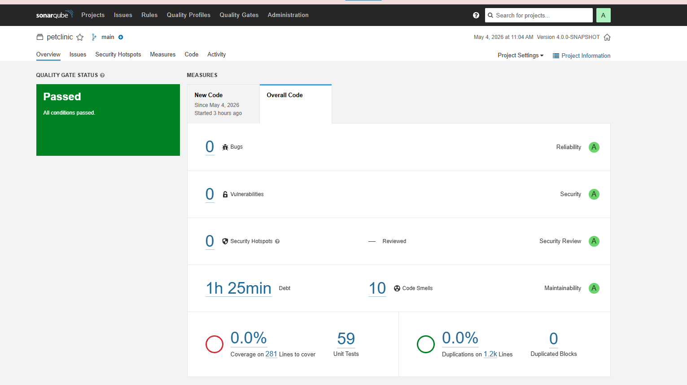
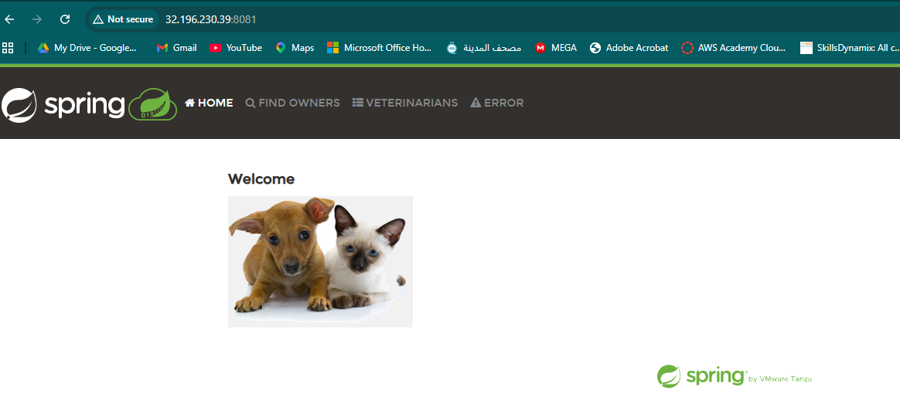

# 🚀 Spring PetClinic CI/CD Pipeline (Jenkins + AWS + Docker + DevSecOps)

This project demonstrates a complete **CI/CD pipeline using Jenkins Shared Library** to build, test, scan, containerize, and deploy the **Spring PetClinic** application to **AWS ECR** and a Docker runtime.

It also integrates **DevSecOps practices** using **SonarQube** and **Trivy** for code quality and security scanning.


---

# 📌 Overview

The pipeline automates the full software delivery lifecycle:

* Source code checkout from GitHub
* Maven-based build and testing
* Static code analysis (SonarQube)
* Security scanning (Trivy)
* Docker image creation
* Push to AWS ECR
* Container deployment on Jenkins agent

---

# 🏗️ Architecture

```
GitHub Repository
        ↓
Jenkins Pipeline (Shared Library)
        ↓
Maven Build & Test
        ↓
SonarQube Analysis
        ↓
Trivy Security Scan
        ↓
Docker Image Build
        ↓
AWS ECR Registry
        ↓
Docker Container Deployment
```

---

# ⚙️ Technologies Used

* Jenkins (CI/CD Orchestration)
* Jenkins Shared Library
* Java Spring Boot (Spring PetClinic)
* Maven
* Docker
* AWS Elastic Container Registry (ECR)
* SonarQube (Code Quality)
* Trivy (Security Scanning)
* AWS CLI

---

# 🔐 DevSecOps Capabilities

This pipeline follows DevSecOps principles by integrating security into every stage:

* ✔ Static Code Analysis with **SonarQube**
* ✔ Container vulnerability scanning with **Trivy**
* ✔ Pipeline failure on **CRITICAL vulnerabilities**
* ✔ Secure dependency and image validation

---

# 🧪 CI/CD Pipeline Stages

## 1. Initialize Variables

Defines:

* Docker image name
* Build version
* AWS region
* ECR repository

---

## 2. Build & Test

```bash
mvn clean compile
mvn test
```

---

## 3. Static Code Analysis (SonarQube)

Performs:

* Code smells detection
* Bug identification
* Security vulnerability analysis

---

## 4. Package Application

```bash
mvn package -DskipTests
```

Generates executable JAR file.

---

## 5. Docker Image Build

Creates versioned Docker image:

```
spring-petclinic:<BUILD_NUMBER>
```

---

## 6. Security Scan (Trivy)

Scans Docker image for:

* OS vulnerabilities
* Java dependency issues
* CVEs (HIGH & CRITICAL severity)

---

## 7. Push to AWS ECR

Uploads Docker image to **AWS Elastic Container Registry (ECR)**.

---

## 8. Deployment

Runs the application container:

```bash
docker run -d -p 8081:8081 spring-petclinic:<BUILD_NUMBER>
```

---

# ☁️ AWS Configuration

## 1. Create ECR Repository

```bash
aws ecr create-repository --repository-name spring-petclinic
```

---

## 2. Required IAM Permissions

Attach the following policy to Jenkins user/role:

* `AmazonEC2ContainerRegistryFullAccess`

---

# 🔑 Jenkins Credentials

| ID          | Type            | Purpose                       |
| ----------- | --------------- | ----------------------------- |
| aws-creds   | AWS Credentials | Authentication with AWS ECR   |
| sonar-token | Secret Text     | Authentication with SonarQube |

---

# 📊 Security Findings (Example)

Trivy may detect:

* **CRITICAL**: Apache Tomcat vulnerabilities
* **CRITICAL**: Thymeleaf template injection risks
* **HIGH**: Jackson JSON parsing vulnerabilities

---

# 📦 Final Output

After successful pipeline execution:

* Docker image is pushed to AWS ECR
* Application is deployed as a container
* Accessible at:

```
http://<jenkins-agent-ip>:8081
```


---

# 🧠 Key DevOps Concepts Demonstrated

* CI/CD automation
* Jenkins Shared Libraries
* Docker containerization
* Cloud registry (AWS ECR)
* DevSecOps integration
* Security scanning in pipelines
* Versioned deployments

* or design a **pipeline flow diagram image**
* or add a **Jenkinsfile section for this project**
